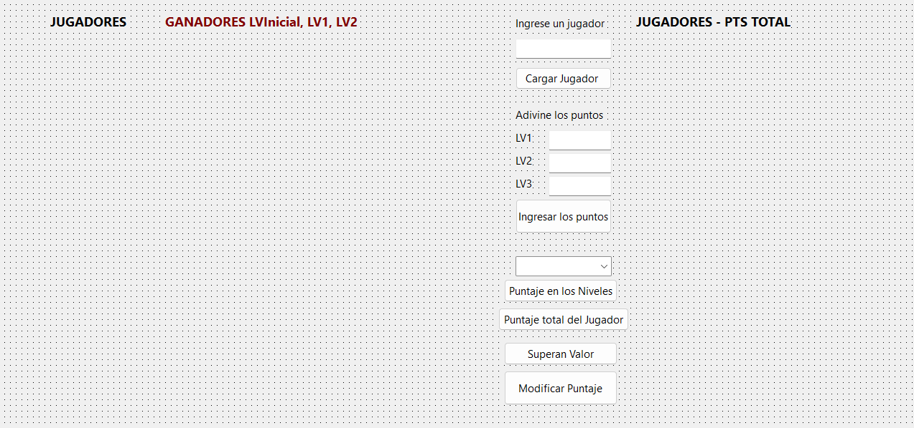

# Pascal: Sistema GUI de Gestión de Jugadores y Auditoría Estadística de Puntajes Coordenados

Este repositorio contiene un sistema interactivo de escritorio desarrollado en **Pascal** mediante el entorno **Lazarus / Delphi** diseñado para administrar registros de usuarios y realizar el seguimiento métrico de rendimiento en entornos interactivos multinivel. La aplicación unifica vectores de caracteres dinámicos con matrices numéricas de dos dimensiones ($20 \times 3$) basadas en indexación base 1, permitiendo la carga secuencial de jugadores, asignación condicional de puntos por niveles (Inicial, Nivel 1 y Nivel 2), modificación interactiva de celdas y filtrado algorítmico de registros con rendimiento sobresaliente.

---

## 📊 Interfaz Gráfica del Sistema

Para documentar el panel de administración y sus componentes de control visual, guarda la captura de pantalla de tu formulario en la raíz del repositorio con el nombre exacto de `interfaz_jugadores.png`:



---

## ⚙️ Arquitectura de Estructuras y Flujos de Control

El código fuente en `src/Unit1.pas` destaca por el cruce relacional de datos y la consistencia en la manipulación de arreglos estructurados:

### 1. Sincronización Matricial y Componentes de Selección (`btn_cargarClick`)
Cuando un jugador es inyectado al sistema, su identificador textual se almacena en el arreglo unidimensional `nombres`. En paralelo, el token es enviado al componente interactivo de selección `TComboBox` para garantizar la integridad referencial de los índices en futuras operaciones:
```pascal
nombres[i] := nombre_jugador;
cmb_jugadores.Items.Add(nombre_jugador); // Registro dinámico en el control desplegable

```

### 2. Evaluación Aritmética Condicional por Reglas de Juego (`btn_puntosClick`)

El módulo convierte las entradas de texto mediante `strtoint()` y las somete a tres reglas de negocio distintas frente a valores pseudoaleatorios generados por el procesador (`random`):

* **Nivel Inicial (Mayoritario):** Requiere que el puntaje del jugador supere estrictamente al valor oculto.
* **Nivel 1 (Minoritario):** Requiere que el puntaje sea menor al límite estocástico establecido.
* **Nivel 2 (Identidad Absoluta):** Requiere igualdad exacta entre la entrada del usuario y el parámetro del sistema. Si la condición falla, la celda coordenaria se penaliza forzando un valor de cero.

### 3. Edición Atómica en Matrices Bidimensionales (`btn_modificar_puntajeClick`)

A través de un ciclo de búsqueda secuencial, el sistema localiza la fila exacta del jugador seleccionado en el ComboBox. Mediante cuadros emergentes interactivas de entrada (`inputbox`), el analista puede alterar directamente una coordenada específica de la matriz (`puntos[pos, nivel_elegido]`) sin corromper el resto de las dimensiones del registro.

---

## 🛠️ Conceptos Técnicos Aplicados

* **Matrices Bidimensionales en Base 1**: Uso de arreglos coordenados estructurados (`array[1..max, 1..3]`) alineados con la lógica algorítmica matemática tradicional para facilitar auditorías por filas (jugadores) y columnas (etapas).
* **Integridad por Selección Activa (`ItemIndex`)**: Implementación de guardas lógicas de salida inmediata (`exit`) si el valor de control del ComboBox es idéntico a `-1`, neutralizando excepciones por punteros nulos en tiempo de ejecución.
* **Filtrado por Umbral de Agregación**: Algoritmo que calcula la sumatoria transversal de una fila de la matriz para aislar y listar únicamente aquellos elementos que superan un límite preestablecido (costo acumulado $> 100$).
* **Inicialización Segura de Bloques de Memoria (`FormCreate`)**: Rutina cíclica anidada encargada de blanquear el espacio direccionable de la matriz al iniciar la aplicación, garantizando la ausencia de basura en memoria RAM.
